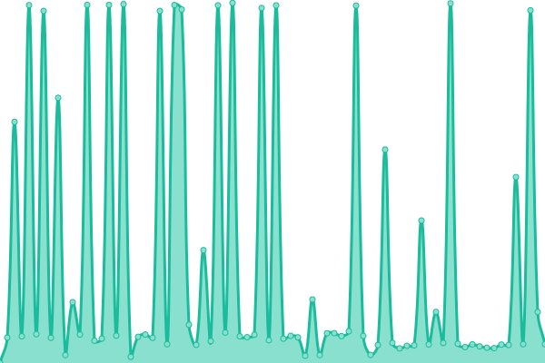
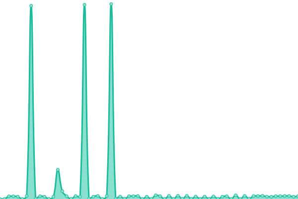
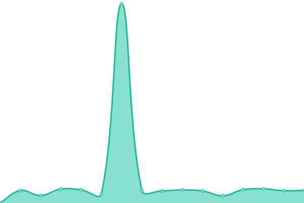

# [📈 Live Status](https://Azael-Dev.github.io/azael-status): <!--live status--> **🟩 All systems operational**

This repository contains the open-source uptime monitor and status page for [Azael Dev](https://www.azael.dev), powered by [Upptime](https://github.com/upptime/upptime).

With [Upptime](https://upptime.js.org), you can get your own unlimited and free uptime monitor and status page, powered entirely by a GitHub repository. We use [Issues](https://github.com/Azael-Dev/azael-status/issues) as incident reports, [Actions](https://github.com/Azael-Dev/azael-status/actions) as uptime monitors, and [Pages](https://Azael-Dev.github.io/azael-status) for the status page.

<!--start: status pages-->
<!-- This summary is generated by Upptime (https://github.com/upptime/upptime) -->
<!-- Do not edit this manually, your changes will be overwritten -->
<!-- prettier-ignore -->
| URL | Status | History | Response Time | Uptime |
| --- | ------ | ------- | ------------- | ------ |
|  Web Server | 🟩 Up | [web-server.yml](https://github.com/Azael-Dev/azael-status/commits/HEAD/history/web-server.yml) | 

 772ms
     
 | 

<a href="https://status.azael.dev/history/web-server">99.91%</a>
    

|  [Portal](https://portal.azael.dev) | 🟩 Up | [portal.yml](https://github.com/Azael-Dev/azael-status/commits/HEAD/history/portal.yml) | 

 190ms
     
 | 

<a href="https://status.azael.dev/history/portal">100.00%</a>
    

|  [CFX Store](https://cfx.azael.dev) | 🟩 Up | [cfx-store.yml](https://github.com/Azael-Dev/azael-status/commits/HEAD/history/cfx-store.yml) | 

 1355ms
     
 | 

<a href="https://status.azael.dev/history/cfx-store">100.00%</a>
    

|  [CFX BanDB](https://bandb.azael.dev) | 🟩 Up | [cfx-ban-db.yml](https://github.com/Azael-Dev/azael-status/commits/HEAD/history/cfx-ban-db.yml) | 

 929ms
     
 | 

<a href="https://status.azael.dev/history/cfx-ban-db">100.00%</a>
    

|  [Documentation](https://docs.azael.dev) | 🟩 Up | [documentation.yml](https://github.com/Azael-Dev/azael-status/commits/HEAD/history/documentation.yml) | 

 184ms
     
 | 

<a href="https://status.azael.dev/history/documentation">100.00%</a>
    

|  [Documentation (Legacy)](https://docs-old.azael.dev) | 🟩 Up | [documentation-legacy.yml](https://github.com/Azael-Dev/azael-status/commits/HEAD/history/documentation-legacy.yml) | 

 166ms
     
 | 

<a href="https://status.azael.dev/history/documentation-legacy">100.00%</a>
    

|  Database | 🟩 Up | [database.yml](https://github.com/Azael-Dev/azael-status/commits/HEAD/history/database.yml) | 

 1268ms
     
 | 

<a href="https://status.azael.dev/history/database">100.00%</a>
    

|  Mailer | 🟩 Up | [mailer.yml](https://github.com/Azael-Dev/azael-status/commits/HEAD/history/mailer.yml) | 

 2948ms
     
 | 

<a href="https://status.azael.dev/history/mailer">100.00%</a>
    

|  Base API | 🟩 Up | [base-api.yml](https://github.com/Azael-Dev/azael-status/commits/HEAD/history/base-api.yml) | 

 339ms
     
 | 

<a href="https://status.azael.dev/history/base-api">100.00%</a>
    

|  Script License API | 🟩 Up | [script-license-api.yml](https://github.com/Azael-Dev/azael-status/commits/HEAD/history/script-license-api.yml) | 

 328ms
     
 | 

<a href="https://status.azael.dev/history/script-license-api">100.00%</a>
    

|  BanDB Report API | 🟩 Up | [ban-db-report-api.yml](https://github.com/Azael-Dev/azael-status/commits/HEAD/history/ban-db-report-api.yml) | 

 304ms
     
 | 

<a href="https://status.azael.dev/history/ban-db-report-api">100.00%</a>
    

|  BanDB Lookup API | 🟩 Up | [ban-db-lookup-api.yml](https://github.com/Azael-Dev/azael-status/commits/HEAD/history/ban-db-lookup-api.yml) | 

 1178ms
     
 | 

<a href="https://status.azael.dev/history/ban-db-lookup-api">100.00%</a>
    

|  Bot Server | 🟩 Up | [bot-server.yml](https://github.com/Azael-Dev/azael-status/commits/HEAD/history/bot-server.yml) | 

 221ms
     
 | 

<a href="https://status.azael.dev/history/bot-server">100.00%</a>
    

|  Discord Bot | 🟩 Up | [discord-bot.yml](https://github.com/Azael-Dev/azael-status/commits/HEAD/history/discord-bot.yml) | 

 220ms
     
 | 

<a href="https://status.azael.dev/history/discord-bot">100.00%</a>
    

|  [Cloudflare](https://www.cloudflarestatus.com/api/v2/status.json) | 🟩 Up | [cloudflare.yml](https://github.com/Azael-Dev/azael-status/commits/HEAD/history/cloudflare.yml) | 

 220ms
     
 | 

<a href="https://status.azael.dev/history/cloudflare">100.00%</a>
    

<!--end: status pages-->

[**Visit our status website →**](https://Azael-Dev.github.io/azael-status)

## 📄 License

- Powered by: [Upptime](https://github.com/upptime/upptime)
- Code: [MIT](./LICENSE) © [Anand Chowdhary](https://anandchowdhary.com), supported by [Pabio](https://pabio.com)
- Data in the `./history` directory: [Open Database License](https://opendatacommons.org/licenses/odbl/1-0/)
